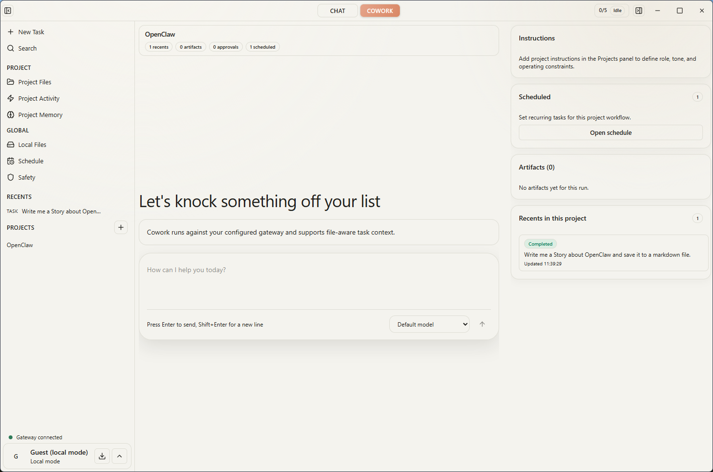

<p align="center">
  
</p>

<p align="center">
  <a href="#what-is-relay"><strong>What Is Relay</strong></a> &middot;
  <a href="#why-relay"><strong>Why Relay</strong></a> &middot;
  <a href="#features"><strong>Features</strong></a> &middot;
  <a href="#use-cases"><strong>Use Cases</strong></a> &middot;
  <a href="#quickstart"><strong>Quickstart</strong></a> &middot;
  <a href="#development"><strong>Development</strong></a>
</p>

<p align="center">
  
  
  
  
</p>

<br/>

## What Is Relay?

# The open-source Claude Cowork for OpenClaw.

**If OpenClaw is the runtime, Relay is your local command center.**

Relay is an Electron desktop app that gives you the same workflow as Claude Cowork (autonomous task execution, scheduling, sub-agents, connectors) but running on **your infrastructure**, with **your choice of model**, and with **real governance built in**.

Cowork is a great product. But there are three structural limits that push companies toward alternatives:

1. **Data sovereignty.** Cowork processes your files on Anthropic's infrastructure. If you're in a regulated industry or have strict data policies, that's a dealbreaker.
2. **Model lock-in.** Cowork only works with Claude. If you want to route tasks to GPT-4, Llama, Gemini, or a custom endpoint, you're out of luck.
3. **Compliance gaps.** Anthropic themselves recommend against using Cowork for regulated workflows because activities aren't yet captured in standard audit logs or compliance APIs.

Relay solves all three. Same workflow pattern, different trust model.

<br/>

## Architecture

```
┌──────────────────────────────────────────────────────────────────────────┐
│                          You (Operator)                                  │
│         give goals · review deliverables · approve risky actions         │
└─────────────────────────────┬────────────────────────────────────────────┘
                              │
              ┌───────────────▼────────────────┐
              │     Relay (Desktop App)        │
              │     ── Control Plane ──        │
              │                                │
              │  Dispatch & Chat               │  You see everything.
              │  • Give a task in natural lang │  You approve what matters.
              │  • Agent plans steps for you   │  You stay in control.
              │  • Review polished deliverable │
              │                                │
              │  Governance                    │
              │  • Approval gates (file ops,   │
              │    shell commands, data sends) │
              │  • Exportable audit trail      │
              │  • Cost tracking per task      │
              │                                │
              │  Configure                     │
              │  • Schedule recurring tasks    │─ ─ ┐ Relay defines.
              │  • Browse & edit agent memory  │    │ OpenClaw executes.
              │  • Manage connectors (Slack,   │    │
              │    Notion, GitHub, Jira, etc.) │    │
              │  • Set project working folder  │    │
              └───────────────┬────────────────┘    │
                              │                     │
                       WebSocket / API              │
                              │                     │
              ┌───────────────▼────────────────┐    │
              │  OpenClaw Gateway (Runtime)    │◄ ─ ┘
              │  local · VPS · custom URL      │
              │  ── Execution Plane ──         │
              │                                │
              │  Agent Runtime                 │  Runs on YOUR infra.
              │  • Autonomous task execution   │  Your keys. Your data.
              │  • Multi-step planning & tools │
              │  • Sub-agent orchestration     │
              │                                │
              │  Persistence                   │
              │  • Memory storage & retrieval  │
              │  • Schedule runner (cron)      │
              │  • File read / write / search  │
              │                                │
              │  Integrations                  │
              │  • Connectors (Slack, Notion,  │
              │    GitHub, Jira, email, etc.)  │
              │  • Computer use (browser, UI)  │
              │  • Shell / script execution    │
              │                                │
              │  Model Router                  │
              │  • Routes to any LLM backend   │
              └──┬──────────┬──────────┬───────┘
                 │          │          │
           ┌─────▼───┐ ┌────▼───┐ ┌────▼─────┐
           │ Claude  │ │ GPT-4  │ │  Llama   │
           │ Gemini  │ │ Mixtral│ │  Custom  │
           └─────────┘ └────────┘ └──────────┘
```

**Relay is the control plane — you see, configure, and approve.
OpenClaw is the execution plane — agents run, remember, and act on your infrastructure.**

```
Example: Scheduled daily briefing

  Relay (you define)                                    OpenClaw (it executes)
  ──────────────────                                    ──────────────────────
  Create schedule: "Daily 8am"          ──────►         Stores schedule
  Set connectors: Slack + Notion                        Cron fires at 8am
                                                        Agent reads project files
                                                        Pulls Slack threads & Notion pages
                                                        Calls LLM (your model choice)
                                                        Writes briefing to memory
  Briefing appears in Relay             ◄──────         Returns deliverable
  You review, approve, or redirect
  Full audit trail exported
```

<br/>

## Why Relay?

| Problem | How Relay handles it |
|---------|---|
| **Data sovereignty** | Your files stay on your machine. Agents run on your server. Your keys. |
| **Model lock-in** | Use any LLM through OpenClaw: Claude, GPT-4, Llama, custom endpoints. |
| **No compliance-ready audit** | Full audit trail with exportable execution history, approval records, and action rationale. |
| **Always-on execution** | Agents run 24/7 on a VPS while you control them from the desktop. |
| **Token cost at scale** | Cowork burns through plan limits fast. With Relay + OpenClaw you manage costs on your own infrastructure. |
| **Syncing friction** | Your workspace files are in agent context in real-time. No FTP, no SSH, no copy-paste. |

<br/>

## How It Works

```
You give the goal → Agent plans the steps → You approve what matters → Agent executes → Everything is logged
```

|        | Step               | What Happens                                              |
| ------ | ------------------ | -------------------------------------------------------- |
| **01** | Connect            | Point Relay to your OpenClaw gateway (local, VPS, or custom). Verify health. |
| **02** | Dispatch           | Give the agent a task in a project context. Agent plans and starts working. |
| **03** | Approve            | High-risk actions pause for your review. You approve, reject, or redirect. |
| **04** | Track              | Full timeline of every action, approval, cost, and result. Exportable. |

<br/>

## Who Should Use Relay

Relay makes sense if:

- You run OpenClaw on a VPS and want a proper desktop control plane for it
- You need data sovereignty (GDPR, HIPAA, or internal policy)
- You work in regulated industries like finance, legal, healthcare, or government
- You want to pick your own model instead of being locked into Claude
- You need exportable audit trails for compliance
- You want to control token costs on your own infrastructure

Relay is probably **not** for you if:

- You're happy using Claude on Anthropic's cloud. Just use Cowork, it's good.
- You want fully autonomous agents with zero human oversight. That's not what this is.

<br/>

## Why Not Just Use a Chat App?

You could wire OpenClaw to Telegram, Discord, or Slack and talk to your agent there. Plenty of people do. But it breaks down quickly once you need more than a text box:

| Capability | Chat app (Telegram, etc.) | Relay |
|---|---|---|
| **Send a message to an agent** | Works fine | Works fine |
| **Approve risky actions before they run** | No approval gates, agent just does it | File deletes, shell commands, data sends pause for review |
| **See what the agent actually did** | You get a text reply, not an execution log | Full timeline: every action, tool call, file change, cost |
| **Schedule recurring tasks** | You'd need a separate cron + glue code | Define schedules in the UI, OpenClaw runs them |
| **Project context** | Every message starts from zero | Tasks scoped to a working folder with persistent context |
| **Agent memory** | Chat history is all you get | Structured memory that persists across sessions |
| **Manage connectors** | You wire each integration yourself | Configure Slack, Notion, GitHub, Jira from the UI |
| **Audit trail** | Scroll through chat logs | Exportable execution history with approval records |
| **Cost visibility** | No idea what a task cost | Token usage and cost tracked per task |
| **Multi-step execution** | Agent replies in one shot | Agent plans steps, uses tools, reports back with deliverables |

A chat app gives you a text box. Relay gives you an operator desk where you can dispatch, govern, track, and audit everything your agent does.

<br/>

## Features

<table>
<tr>
<td align="center" width="33%">
<h3>Desktop First</h3>
Native Electron app with persistent local state. This is a proper desktop tool, not a browser tab.
</td>
<td align="center" width="33%">
<h3>Chat + Execution</h3>
Dispatch tasks, guide decisions, and review results in one interface.
</td>
<td align="center" width="33%">
<h3>Project Context</h3>
Every task is scoped to a working folder. No context drift between runs.
</td>
</tr>
<tr>
<td align="center">
<h3>Approval Gates</h3>
File deletes, shell commands, data exports: risky actions pause for your review before they run.
</td>
<td align="center">
<h3>Audit Trail</h3>
Every action logged with execution timeline, rationale, and approval records. All exportable.
</td>
<td align="center">
<h3>Flexible Routing</h3>
Connect to local, VPS, or custom OpenClaw-compatible endpoints. Use any model.
</td>
</tr>
<tr>
<td align="center">
<h3>Memory System</h3>
Persistent operator context injected into every interaction. Agents remember what matters.
</td>
<td align="center">
<h3>Scheduling</h3>
Create recurring tasks from the UI. Daily reports, weekly cleanups, continuous monitoring.
</td>
<td align="center">
<h3>Full Visibility</h3>
Files, activity, memory, schedule, safety, and approvals all visible in one place.
</td>
</tr>
</table>

<br/>

## Relay vs Claude Cowork

| Capability | Relay | Claude Cowork |
|---------|-------|---------------|
| **Autonomous task execution** | Yes | Yes |
| **Scheduling** | Yes | Yes |
| **Sub-agents / multi-agent** | Yes | Yes |
| **Connectors / integrations** | Yes | Yes (Anthropic cloud) |
| **Desktop app** | Yes | Yes |
| **Local file access** | Truly local, on your machine | Processed on Anthropic's infrastructure |
| **Self-hosted runtime** | Yes | No |
| **Model choice** | Any model via OpenClaw | Claude only |
| **Compliance-ready audit trail** | Exportable | Not in audit logs or compliance APIs yet |
| **Approval gates** | Per-action risk scopes | Limited |
| **Data on your infrastructure** | Yes | No |
| **Token cost control** | Your infra, your budget | Plan limits apply |

Cowork is a great product for personal productivity on Anthropic's cloud. Relay exists for teams and companies that need data sovereignty, compliance-ready audit trails, and model freedom on their own infrastructure.

Anthropic themselves recommend against using Cowork for regulated workflows because activities are not yet captured in standard audit logs or compliance APIs. That's the gap Relay is built for.

<br/>

## Use Cases

### Operations: Daily Briefing
You schedule a daily task. The agent synthesizes metrics, customer feedback, and team updates overnight. Results show up in Relay each morning. You review them and decide what to act on.

### Finance: Expense Approval
The agent flags an exception in an expense report. Relay pauses for approval. The finance lead reviews the context and risk level, approves or asks for clarification, and the action executes with a full audit receipt.

### Compliance: Recurring Audit Prep
You set up a recurring task: "Every Friday, scan all project changes and produce a compliance summary." The agent runs on schedule, results appear in Relay, and the audit trail is ready to export.

### Technical: Code Review Automation
The agent runs `npm test`, scans for TODO comments, and produces a summary. Shell commands require your approval. You review results and trigger follow-up actions from one thread.

### Product: Feedback Synthesis
Customer feedback is scattered across email, Slack, and support tickets. The agent collects it, clusters themes by priority, and produces roadmap recommendations you can actually act on.

### Content: Weekly Planning
You tell the agent: "Every Friday, summarize trending topics in our space and draft 3 content ideas." Results are ready Monday morning. The team reviews, approves, and drops them into the editorial calendar.

<br/>

## Why Not Just Use Cowork?

| If you need... | Use Cowork | Use Relay |
| --- | --- | --- |
| Personal AI productivity | Great fit | Overkill |
| Data sovereignty (GDPR, HIPAA) | Data goes to Anthropic | Your infrastructure |
| Compliance-ready audit logs | Not available yet | Built in, exportable |
| Model flexibility | Claude only | Any model via OpenClaw |
| Token cost control | Plan limits | Your infra, your budget |
| Team approval workflows | Limited | Per-action risk scopes |
| Always-on agents on your VPS | Anthropic's cloud | Your server, 24/7 |

<br/>

## Quickstart

**Requirements:**
- Node.js 20+
- npm 10+

**Install & run:**

```bash
git clone https://github.com/SeventeenLabs/relay.git
cd relay
npm install
npm run dev
```

This starts Vite, compiles Electron in watch mode, and launches Relay.

**Optional cloud auth setup:**

```bash
cp .env.example .env
```

Set these when needed:
- `VITE_SUPABASE_URL`
- `VITE_SUPABASE_ANON_KEY`

<br/>

## Gateway Setup

In **Settings > Gateway**:

1. Enter your OpenClaw gateway URL and token
2. Save
3. Run the health check

**Typical endpoint patterns:**

- **Local:** `ws://127.0.0.1:18789`
- **VPS:** `wss://your-domain.com`
- **Custom:** Any OpenClaw-compatible endpoint

<br/>

## Development

```bash
npm run dev                 # Full desktop dev loop
npm run build               # Build renderer + electron
npm run preview             # Preview renderer build
npm run package             # Build and package app to release/
npm run lint                # ESLint
npm run typecheck           # TS type checks (renderer + electron)
npm run verify              # lint + typecheck + smoke tests
npm run test:local-actions  # Local actions smoke tests
npm run test:e2e            # Electron E2E tests (mock gateway)
```

<br/>

## Community

- **Security issues:** hello@seventeenlabs.io
- **Bug reports & feature requests:** [GitHub Issues](https://github.com/SeventeenLabs/relay/issues)
- **Contributions:** [CONTRIBUTING.md](CONTRIBUTING.md)
- **Code of conduct:** [CODE_OF_CONDUCT.md](CODE_OF_CONDUCT.md)
- **Security policy:** [SECURITY.md](SECURITY.md)
- **Support:** [SUPPORT.md](SUPPORT.md)

<br/>

## Open Source

- License: [MIT](LICENSE)
- Copyright © 2026 SeventeenLabs

---

**Get started:** [Download](https://github.com/SeventeenLabs/relay/releases) the latest build or clone and run locally.

**Questions?** Open an issue or email hello@seventeenlabs.io.
