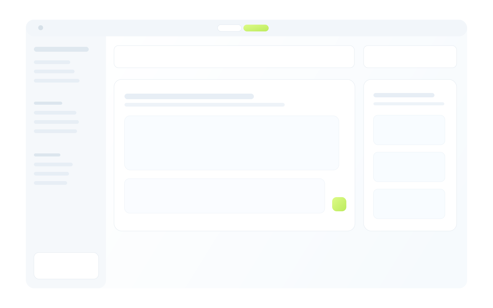

<p align="center">
  
</p>

<p align="center">
  <a href="#what-is-relay"><strong>What Is Relay</strong></a> &middot;
  <a href="#why-relay"><strong>Why Relay</strong></a> &middot;
  <a href="#features"><strong>Features</strong></a> &middot;
  <a href="#use-cases"><strong>Use Cases</strong></a> &middot;
  <a href="#quickstart"><strong>Quickstart</strong></a> &middot;
  <a href="#development"><strong>Development</strong></a>
</p>

<p align="center">
  
  
  
  
</p>

<br/>

## What Is Relay?

# The open-source Claude Cowork for OpenClaw.

**If OpenClaw is the runtime, Relay is your local command center.**

Relay is an Electron desktop app that gives you the same experience as Claude Cowork — autonomous task execution, scheduling, sub-agents, connectors — but on **your infrastructure**, with **your model**, and with **real governance**.

Claude Cowork is excellent. But companies are looking for alternatives because of three structural limits:

1. **Data sovereignty** — Cowork runs files through a sandboxed VM on Anthropic's servers. Regulated industries can't send sensitive data there.
2. **Model lock-in** — Cowork only works with Claude. Companies want to route tasks to GPT-4, Llama, Gemini, or custom endpoints.
3. **Compliance gaps** — Anthropic themselves recommend against using Cowork for regulated workflows because activities aren't yet captured in standard audit logs or compliance APIs.

Relay solves all three. Same workflow pattern — different trust model.

<br/>

## Why Relay?

| Problem | Relay's Answer |
|---------|---|
| **Data sovereignty** | Your files never leave your machine. Agents run on your server. Your keys. |
| **Model lock-in** | Use any LLM through OpenClaw. Claude, GPT-4, Llama, custom endpoint — your choice. |
| **No compliance-ready audit** | Full audit trail with exportable execution history, approval records, and action rationale. |
| **Always-on execution** | Agents run 24/7 on a VPS while you control them from the desktop. |
| **Token cost at scale** | Cowork burns through plan limits fast. Relay + OpenClaw lets you manage costs with your own infrastructure. |
| **No syncing friction** | Your workspace files are in agent context in real-time. No FTP, no SSH, no copy-paste. |

<br/>

## How It Works

```
You give the goal → Agent plans the steps → You approve what matters → Agent executes → Everything is logged
```

|        | Step               | What Happens                                              |
| ------ | ------------------ | -------------------------------------------------------- |
| **01** | Connect            | Point Relay to your OpenClaw gateway (local, VPS, or custom). Verify health. |
| **02** | Dispatch           | Give the agent a task in a project context. Agent plans and starts working. |
| **03** | Approve            | High-risk actions pause for your review. You approve, reject, or redirect. |
| **04** | Track              | Full timeline: every action, approval, cost, and result — exportable. |

<br/>

## Who Should Use Relay

- ✅ You run OpenClaw on a VPS and want a desktop control plane
- ✅ You need data sovereignty (GDPR, HIPAA, or internal policy)
- ✅ You work in regulated industries (finance, legal, healthcare, government)
- ✅ You want model-agnostic routing, not Claude-only lock-in
- ✅ You need exportable audit trails for compliance
- ✅ You want to control token costs on your own infrastructure

**Not for you if:**
- ❌ You're happy with Claude-only on Anthropic's cloud (just use Cowork)
- ❌ You want fully autonomous agents with zero human oversight

<br/>

## Features

<table>
<tr>
<td align="center" width="33%">
<h3>🖥️ Desktop First</h3>
Native Electron app with persistent local state. Reliable day-to-day operations, not a browser tab.
</td>
<td align="center" width="33%">
<h3>💬 Chat + Execution</h3>
Dispatch tasks, guide decisions, and review results in one unified interface.
</td>
<td align="center" width="33%">
<h3>📂 Project Context</h3>
Every task scoped to a working folder. No context drift between runs.
</td>
</tr>
<tr>
<td align="center">
<h3>✅ Approval Gates</h3>
File deletes, shell commands, data exports — risky actions pause for your review.
</td>
<td align="center">
<h3>🔐 Audit Trail</h3>
Every action logged with execution timeline, rationale, and approval records. Exportable.
</td>
<td align="center">
<h3>🔌 Flexible Routing</h3>
Connect to local, VPS, or custom OpenClaw-compatible endpoints. Any model.
</td>
</tr>
<tr>
<td align="center">
<h3>🧠 Memory System</h3>
Persistent operator context injected into every interaction. Agents remember.
</td>
<td align="center">
<h3>📅 Scheduling</h3>
Create recurring tasks from the UI. Daily reports, weekly cleanups, continuous monitoring.
</td>
<td align="center">
<h3>📊 Full Visibility</h3>
Files, activity, memory, schedule, safety, and approvals in one operator shell.
</td>
</tr>
</table>

<br/>

## Relay vs Claude Cowork

| Capability | Relay | Claude Cowork |
|---------|-------|---------------|
| **Autonomous task execution** | ✅ | ✅ |
| **Scheduling** | ✅ | ✅ |
| **Sub-agents / multi-agent** | ✅ | ✅ |
| **Connectors / integrations** | ✅ | ✅ (Anthropic cloud) |
| **Desktop app** | ✅ | ✅ |
| **Local file access** | ✅ Truly local | ⚠️ Sandboxed VM on Anthropic's servers |
| **Self-hosted runtime** | ✅ | ❌ |
| **Model choice** | ✅ Any model via OpenClaw | ❌ Claude only |
| **Compliance-ready audit trail** | ✅ Exportable | ❌ Not in audit logs or compliance APIs yet |
| **Approval gates** | ✅ Per-action risk scopes | ⚠️ Limited |
| **Data on your infrastructure** | ✅ | ❌ |
| **Token cost control** | ✅ Your infra, your budget | ⚠️ Plan limits, high token burn |

**The bottom line:** Claude Cowork is excellent for personal productivity on Anthropic's cloud. Relay is for teams and companies that need **data sovereignty, compliance-ready audit trails, and model freedom** — all on their own infrastructure.

> **Note:** Anthropic recommends against using Cowork for strongly regulated workflows because activities are not yet captured in standard audit logs or compliance APIs. Relay is built for exactly this gap.

<br/>

## Use Cases

### Operations: Daily Briefing
Schedule a daily task → Agent synthesizes metrics, customer feedback, and team updates overnight → Results appear in Relay each morning → Operator reviews and acts on decision-ready recommendations.

### Finance: Expense Approval
Agent flags an exception in an expense report → Relay pauses for approval → Finance lead reviews context and risk level → Approves or requests clarification → Action executes with full audit receipt.

### Compliance: Recurring Audit Prep
"Every Friday, scan all project changes and produce a compliance summary" → Agent runs on schedule → Results appear in Relay → Exportable audit trail ready for review.

### Technical: Code Review Automation
Agent runs `npm test`, scans for TODO comments, and produces a summary → Shell commands require approval → Operator reviews results → Follow-up actions triggered from one thread.

### Product: Feedback Synthesis
Customer feedback scattered across email, Slack, and support tickets → Agent collects and synthesizes → Clusters themes with priority logic → Produces actionable roadmap recommendations.

### Content: Weekly Planning
"Every Friday, summarize trending topics in our space and draft 3 content ideas" → Results appear Monday morning → Team reviews and approves → Straight into the editorial calendar.

<br/>

## Why Not Just Use Cowork?

| If you need... | Use Cowork | Use Relay |
| --- | --- | --- |
| Personal AI productivity | ✅ Great fit | Overkill |
| Data sovereignty (GDPR, HIPAA) | ❌ Data goes to Anthropic | ✅ Your infrastructure |
| Compliance-ready audit logs | ❌ Not available yet | ✅ Built in, exportable |
| Model flexibility | ❌ Claude only | ✅ Any model via OpenClaw |
| Token cost control | ❌ Plan limits | ✅ Your infra, your budget |
| Team approval workflows | ⚠️ Limited | ✅ Per-action risk scopes |
| Always-on agents on your VPS | ❌ Anthropic's cloud | ✅ Your server, 24/7 |

<br/>

## Quickstart

**Requirements:**
- Node.js 20+
- npm 10+

**Install & run:**

```bash
git clone https://github.com/SeventeenLabs/relay.git
cd relay
npm install
npm run dev
```

This starts Vite, compiles Electron in watch mode, and launches Relay.

**Optional cloud auth setup:**

```bash
cp .env.example .env
```

Set these when needed:
- `VITE_SUPABASE_URL`
- `VITE_SUPABASE_ANON_KEY`

<br/>

## Gateway Setup

In **Settings → Gateway**:

1. Enter your OpenClaw gateway URL and token
2. Save
3. Run the health check

**Typical endpoint patterns:**

- **Local:** `ws://127.0.0.1:18789`
- **VPS:** `wss://your-domain.com`
- **Custom:** Any OpenClaw-compatible endpoint

<br/>

## Development

```bash
npm run dev                 # Full desktop dev loop
npm run build               # Build renderer + electron
npm run preview             # Preview renderer build
npm run package             # Build and package app to release/
npm run lint                # ESLint
npm run typecheck           # TS type checks (renderer + electron)
npm run verify              # lint + typecheck + smoke tests
npm run test:local-actions  # Local actions smoke tests
npm run test:e2e            # Electron E2E tests (mock gateway)
```

<br/>

## Community

- **Security issues:** hello@seventeenlabs.io
- **Bug reports & feature requests:** [GitHub Issues](https://github.com/SeventeenLabs/relay/issues)
- **Contributions:** [CONTRIBUTING.md](CONTRIBUTING.md)
- **Code of conduct:** [CODE_OF_CONDUCT.md](CODE_OF_CONDUCT.md)
- **Security policy:** [SECURITY.md](SECURITY.md)
- **Support:** [SUPPORT.md](SUPPORT.md)

<br/>

## Open Source

- License: [MIT](LICENSE)
- Copyright © 2026 SeventeenLabs
- Built for operators who believe AI should be governed, auditable, and under human control.

---

**Get started:** [Download](https://github.com/SeventeenLabs/relay/releases) the latest build or clone and run locally.

**Questions?** Open an issue or reach out to hello@seventeenlabs.io.
